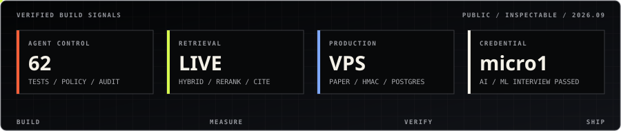
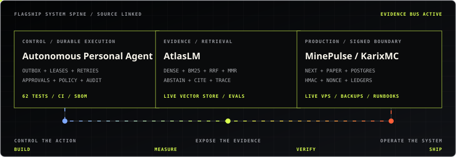

<div align="center">



### I build AI systems that can explain their decisions, survive failure, and operate beyond the demo.

[](https://aman-kumar-ai-portfolio.vercel.app)
[](mailto:amankumr3254u@gmail.com)
[](https://www.google.com/maps/place/Bengaluru)
[](https://aman-kumar-ai-portfolio.vercel.app/profile/aman-kumar-resume.pdf)

[**Portfolio**](https://aman-kumar-ai-portfolio.vercel.app) · [**Résumé**](https://aman-kumar-ai-portfolio.vercel.app/profile/aman-kumar-resume.pdf) · [**LinkedIn**](https://www.linkedin.com/in/aman-kumar-494601329) · [**Email**](mailto:amankumr3254u@gmail.com) · [**X**](https://x.com/Aman1181)

</div>



## Three systems worth opening



| Flagship | What the repository proves | Inspect |
|---|---|---|
| **Autonomous Personal Agent** | A security-first agent control plane with transactional task/outbox state, worker leases, retries, dead letters, approvals, policies, audit trails, PostgreSQL/pgvector, Redis, Docker, and **62 passing tests**. | [Source](https://github.com/ReaperXD67/autonomous-personal-agent) · [CI](https://github.com/ReaperXD67/autonomous-personal-agent/actions/workflows/ci.yml) |
| **AtlasLM** | A live evidence-grounded RAG system with deterministic ingestion, hybrid dense + BM25 retrieval, RRF, reranking, MMR, abstention, citations, evaluation checks, and visible traces. | [Live](https://notebooklm-rag-five.vercel.app) · [Source](https://github.com/ReaperXD67/notebooklm-rag) · [Health](https://notebooklm-rag-five.vercel.app/api/health) |
| **MinePulse / KarixMC** | A production VPS marketplace crossing a signed Paper-plugin boundary with PostgreSQL, Redis, HMAC authentication, replay protection, transactional ledgers, encrypted secrets, backups, and rollback runbooks. | [Live](https://karixmc.pl) · [Source](https://github.com/ReaperXD67/MinePulse) · [Plugin](https://karixmc.pl/plugin) |

<details>
<summary><strong>Why these three</strong></summary>

- **Autonomous Personal Agent** shows backend and agent-systems depth.
- **AtlasLM** shows applied LLM, retrieval, evaluation, and observability work.
- **MinePulse** proves full-stack ownership and production operations outside a serverless demo.

</details>

## Operating context

```text
NOW          Project Lead Developer Intern · SIP Organization · Jul 2026 → Present
BEFORE       AI Engineer Intern · micro1 · Aug 2025 → Jul 2026
INDEPENDENT  AI / ML Developer · 2025 → Present
EDUCATION    B.Sc. Computer Science · Scaler School of Technology × BITS Pilani
OPEN TO      AI engineering · full-stack roles · internships · contract builds
```

[One-page ATS résumé](https://aman-kumar-ai-portfolio.vercel.app/profile/aman-kumar-resume.pdf) · [micro1 AI/ML credential](https://aman-kumar-ai-portfolio.vercel.app/assets/micro1-certification.jpg)

## More systems

- **[Revive](https://github.com/ReaperXD67/revive-ai)** - explainable payment-recovery orchestration with deterministic policies, immutable audit evidence, a live backend, 16 tests, and 95%+ core coverage. [Live](https://revive-revenue.vercel.app)
- **[AtlasForge AI](https://github.com/ReaperXD67/atlasforge-ai)** - local-first AI video production pipeline with provider fallbacks, FFmpeg composition, checkpoints, cost controls, and 125 passing tests.
- **[Distributed Search Typeahead](https://github.com/ReaperXD67/distributed-search-typeahead)** - FastAPI, PostgreSQL, Redis Streams, consistent hashing, write batching, failover, metrics, tests, and production smoke checks.
- **[GPT Prototype](https://github.com/ReaperXD67/GPT-Prototype)** - a 125M-parameter decoder-only transformer implemented from first principles with RoPE, RMSNorm, QK-Norm, and Muon + AdamW.

## Engineering surface

**AI systems:** LLM applications · agentic workflows · RAG · hybrid retrieval · evaluation · citations · observability · human approval · guardrails

**Backend:** Python · TypeScript · FastAPI · Next.js · React · Java · REST APIs · OAuth · signed webhooks

**Data and infrastructure:** PostgreSQL · pgvector · Redis · Qdrant · Upstash Vector · Prisma · Docker · Linux · Nginx · GitHub Actions · Vercel · VPS

**Automation:** PyTorch · OpenRouter · n8n · Dify · YouTube Data API · provider fallbacks · secure tool execution

## Public build signal



<sub>Generated daily from public GitHub data inside this repository. No tracking pixel or third-party stats service.</sub>

## Contact

```text
PORTFOLIO  https://aman-kumar-ai-portfolio.vercel.app
RÉSUMÉ     https://aman-kumar-ai-portfolio.vercel.app/profile/aman-kumar-resume.pdf
EMAIL      amankumr3254u@gmail.com
LINKEDIN   https://www.linkedin.com/in/aman-kumar-494601329
X          https://x.com/Aman1181
```

<div align="center">

**Build the proof. Instrument the uncertainty. Ship the system.**

</div>
