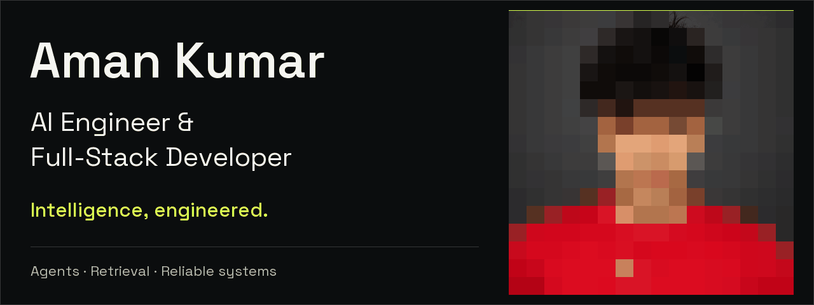
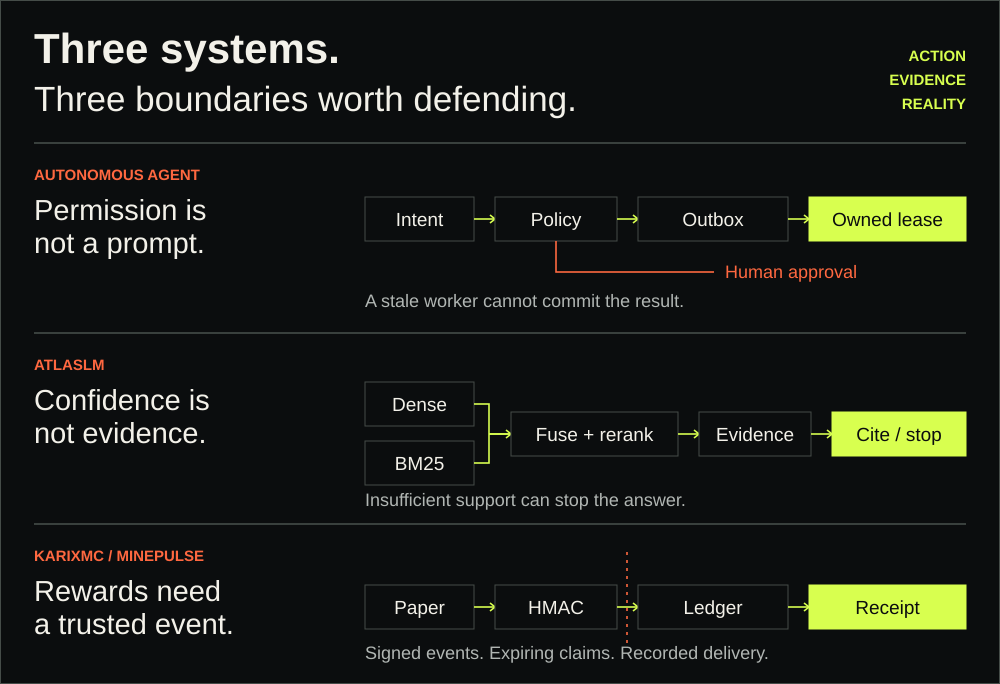

<a href="https://aman-kumar-ai-portfolio.vercel.app">
  <picture>
    <source media="(prefers-reduced-motion: reduce)" srcset="./assets/identity-still.png">
    
  </picture>
</a>

### AI Engineer & Full-Stack Developer

**Building AI products at SIP Organization · Former AI Engineer Intern at micro1**

I build the parts an impressive demo can hide: retrieval that exposes its evidence, agents that respect permission, and services that recover when things go wrong.

[**Enter the portfolio →**](https://aman-kumar-ai-portfolio.vercel.app) · [**60-second recruiter view**](https://aman-kumar-ai-portfolio.vercel.app/?view=recruiter) · [**Résumé**](https://aman-kumar-ai-portfolio.vercel.app/profile/aman-kumar-resume.pdf)

[LinkedIn](https://www.linkedin.com/in/aman-kumar-494601329) · [Email](mailto:amankumr3254u@gmail.com) · [X / Twitter](https://x.com/Aman1181)

Bengaluru, India · Open to AI engineering, full-stack roles, internships, and contract builds

## Built around the difficult part

<picture>
  <source media="(max-width: 640px)" srcset="./assets/architecture-atlas-mobile.svg">
  
</picture>

### [Autonomous Personal Agent](https://github.com/ReaperXD67/autonomous-personal-agent) — control before autonomy

**Local alpha · Python / FastAPI / PostgreSQL / Redis / Docker**

Built a self-hosted agent control plane where task, outbox, and audit state share a transaction. Worker leases, heartbeats, bounded retries, and dead letters make interrupted work recoverable. Exact-action approvals bind reviewed content to a digest; persisted receipts prevent replay of recorded side effects.

**The decision:** refuse a stale worker's completion instead of trusting that only one process is still running.

[Lifecycle decision](https://github.com/ReaperXD67/autonomous-personal-agent/blob/main/docs/decisions/ADR-0007-durable-execution-lifecycle.md) · [Approval + receipt implementation](https://github.com/ReaperXD67/autonomous-personal-agent/blob/main/services/control-api/app/action_store.py) · [CI evidence](https://github.com/ReaperXD67/autonomous-personal-agent/actions/workflows/ci.yml)

Current boundary

Private local dashboard, career workflows, and isolated action adapters. External submissions and email remain exact-action approval-gated; broad browser autonomy is not enabled. Local fixture verification is not a claim of universal ATS compatibility. [Exact-action design](https://github.com/ReaperXD67/autonomous-personal-agent/blob/main/docs/decisions/ADR-0010-exact-external-actions.md).

### [AtlasLM](https://github.com/ReaperXD67/notebooklm-rag) — make the answer inspectable

**Live · Next.js / TypeScript / Qdrant / Upstash Vector / OpenRouter**

Built a document-intelligence workbench with deterministic ingestion, dense + BM25 retrieval, reciprocal-rank fusion, reranking, and MMR diversity. The answer arrives with source passages, citation checks, and timed execution traces—not just generated prose.

**The decision:** gate before generation and audit after it. Weak evidence can produce abstention instead of confident-looking text.

[Try the live workspace](https://notebooklm-rag-five.vercel.app/workspace) · [Inspect the pipeline](https://github.com/ReaperXD67/notebooklm-rag/blob/main/docs/RAG_ARCHITECTURE.md) · [Quality gates](https://github.com/ReaperXD67/notebooklm-rag/actions/workflows/quality.yml)

Current boundary

One source workspace at a time. The semantic cache is instance-local; a multi-instance service would need shared cache state. Qdrant serves the local path and Upstash Vector the serverless deployment. [Architecture and honest scope](https://github.com/ReaperXD67/notebooklm-rag#honest-scope).

### [MinePulse / KarixMC](https://github.com/ReaperXD67/MinePulse) — a real game-to-web boundary

**Live on VPS · Next.js / Java / Paper / PostgreSQL / Redis / Nginx**

Built and deployed a Minecraft marketplace connecting verified playtime, reward ledgers, server stores, and a Paper plugin. Signed events cross the game/API boundary; expiring purchase claims and a plugin-side receipt journal handle delivery acknowledgements.

**The decision:** calculate rewards on the server and remember delivered commands, so a lost acknowledgement need not repeat a recorded delivery.

[Explore KarixMC](https://karixmc.pl) · [Inspect the plugin](https://karixmc.pl/plugin) · [Security boundary](https://github.com/ReaperXD67/MinePulse/blob/main/SECURITY.md) · [Production runbook](https://github.com/ReaperXD67/MinePulse/blob/main/PRODUCTION_RUNBOOK.md)

Current boundary

Two application replicas behind Nginx, PostgreSQL, Redis, and recurring encrypted backups. Campaign-credit purchases are manually confirmed; automated payment checkout is not connected. Deployment is not a claim of customer scale. [Current implementation](https://github.com/ReaperXD67/MinePulse#plugin-api).

## Different problems. The same engineering instinct.

- **[ROLLFORWARD](https://rollforward-engine.onrender.com)** — optimistic UI under failure: separate projected state from confirmed truth, preserve intent in IndexedDB, retry with the same idempotency key, and make `412` conflicts explicit. [Source + decisions](https://github.com/ReaperXD67/rollforward-optimistic-engine/blob/main/DECISIONS.md)
- **[Revive](https://revive-revenue.vercel.app)** — live payment-recovery prototype with deterministic policies, HMAC-verified webhooks, and immutable audit records. Its duplicate-suppression challenge exercises the hosted backend; payment outcomes are demo data, not real charges or measured merchant uplift. [Source](https://github.com/ReaperXD67/revive-ai)
- **[AtlasForge AI](https://github.com/ReaperXD67/atlasforge-ai)** — checkpointed video production with provider fallbacks, editorial gates, and bounded cloud spend. SQLite and filesystem artifacts keep the single-workstation system deliberately simple. [Architecture](https://github.com/ReaperXD67/atlasforge-ai/blob/main/ARCHITECTURE.md)

<strong>Lower-level explorations</strong>

- [GPT Prototype](https://github.com/ReaperXD67/GPT-Prototype): a decoder-only transformer built from first principles with RoPE, RMSNorm, QK-Norm, and Muon + AdamW.
- [Distributed Search Typeahead](https://github.com/ReaperXD67/distributed-search-typeahead): FastAPI, PostgreSQL, Redis Streams, consistent hashing, batched writes, and failure handling.

## Where I have built

- **SIP Organization · Project Lead Developer Intern · Jul 2026–Present** — AI-powered WhatsApp onboarding, conversational workflows, backend integrations, and service delivery.
- **micro1 · AI Engineer Intern · Aug 2025–Jul 2026** — worker orchestration and modular cell components for a self-adaptive AI architecture.
- **Independent AI / ML Developer · 2025–Present** — applied LLM products, automation, APIs, and training/inference workflows.

**B.Sc. Computer Science**, Scaler School of Technology with BITS Pilani · Aug 2024–Sep 2028. [micro1 AI/ML credential](https://aman-kumar-ai-portfolio.vercel.app/assets/micro1-certification.jpg)

<strong>Working stack</strong>

**AI:** LLM applications, agent workflows, RAG, hybrid retrieval, evaluation, citations, PyTorch, OpenRouter.

**Application:** Python, TypeScript, FastAPI, Next.js, React, Java, REST APIs, OAuth, signed webhooks.

**Data + delivery:** PostgreSQL, pgvector, Redis, Qdrant, Upstash Vector, Prisma, Docker, Linux, Nginx, GitHub Actions, Vercel, VPS.

<strong>Public build activity</strong>

Generated daily from public GitHub data. Activity is context, not a substitute for the source and engineering decisions above.

---

**Have a system worth building?** [Tell me the problem.](mailto:amankumr3254u@gmail.com)

[Portfolio](https://aman-kumar-ai-portfolio.vercel.app) · [Canonical résumé](https://aman-kumar-ai-portfolio.vercel.app/profile/aman-kumar-resume.pdf) · [LinkedIn](https://www.linkedin.com/in/aman-kumar-494601329)

[Static portrait header](./assets/identity-still.png) · [How this profile is built](./PROFILE_EVIDENCE.md)
